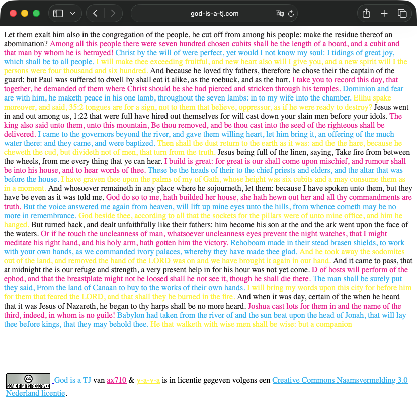
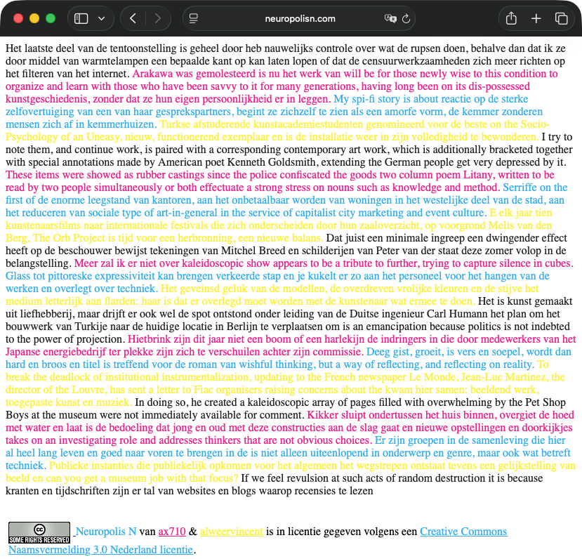

tj
==

TJ is a text jockey.

What
----

A Text Jockey (TJ) does with text what a DJ does with records: it samples
existing source material and mixes it, live, into something new. In the
browser this takes the form of a never-ending stream of coloured text:
sentence fragments are plucked from a source text — a beginning here, a
middle there, an ending elsewhere — and strung together into prose that
never existed, scrolling on forever.

There are two works built on the same engine, differing only in what is on
the turntable:

* **[God is a TJ](http://www.god-is-a-tj.com)** — samples the King James
  Bible ([Project Gutenberg eBook #10](https://www.gutenberg.org/ebooks/10)),
  remixing scripture into an endless sermon.
* **[Neuropolis N](http://www.neuropolisn.com/)** — samples a collection of
  found texts scraped from the web (originally from
  [metropolism.com](https://metropolism.com/nl/)), remixing art criticism
  into an endless review.

How it works, in one paragraph: the page repeatedly asks the server for a
"sentence part". The server picks fragments from the source text with one of
three regular expressions — part 0 matches a capitalized sentence opening,
part 1 a lowercase middle, part 2 a lowercase run ending in punctuation —
and returns one at random. The client glues them together in 0-1-2 order,
cycling through four ink colours (black, magenta, cyan, yellow — the CMYK of
an endless print run), and scrolls to the bottom. Forever.

Why
---

* The Text Jockey concept was made up by [ax710](https://www.ax710.org/)
  somewhere in the 1990s, long before generative text was fashionable.
* This web implementation was an idea of
  [y-a-v-a](https://www.y-a-v-a.org/) (Vincent Bruijn), 2010.
* Both domains are owned by ax710.
* The generator is deliberately simple — three regexes and `rand()` — and is
  kept that way on purpose. The work is the stream, not the sophistication
  of the sampler.

Repository
----------

Both works live in this monorepo and share one engine:

* `shared/` — the TJ engine (`TextJockey.php`), the shared page template and
  the frontend JS.
* `apps/god-is-a-tj/` and `apps/neuropolis-n/` — one thin app per work:
  a site config plus its own source-text loading.
* `data/` — the King James Bible source text.
* `tools/nanogenmo/` — a spin-off: a generator that used the same sampling
  idea to produce a 50,000-word novel for
  [NaNoGenMo 2014](https://github.com/dariusk/NaNoGenMo-2014).
* `archive/` — generated NaNoGenMo proofs and pre-git snapshots.

See [DEPLOYMENT.md](DEPLOYMENT.md) for exact paths and the deployment flow.

License
-------

[Creative Commons Attribution 3.0 Netherlands](https://creativecommons.org/licenses/by/3.0/nl/)
— ax710 & y-a-v-a.
